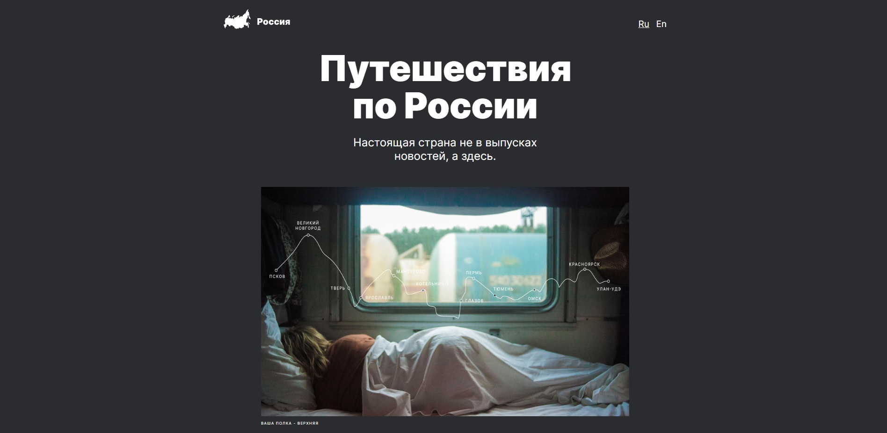

<h1 align="center">Project "Russian travel"</h1>

<h2 align="center"><a  href="https://danielloxxi.github.io/Russian-travel/">Test site</a></h2>

## Description

Beginner level landing, adaptation for mobile devices and laptops, 

## Used technologies: 

- **CSS BEM** 
- **HTML**

## Try my other projects!

<h2 align="center">
</h2>
